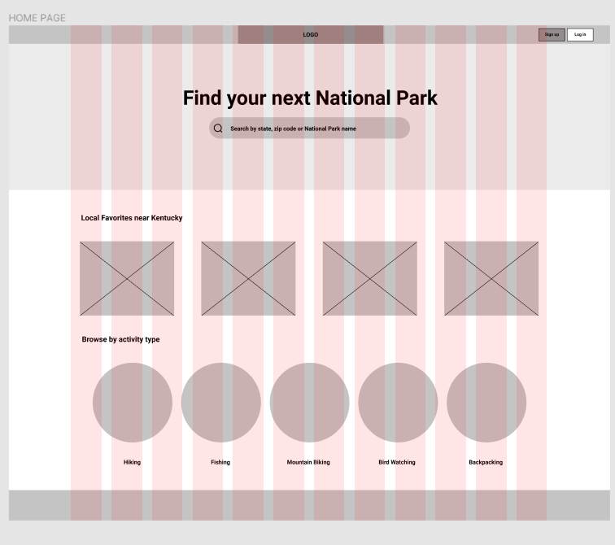
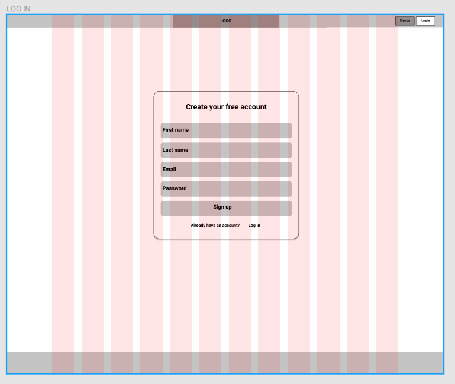

# Park Hopper

## Wireframe by UX team

## Technologies Used

Front-End:
React.js

Back-End:
Mongo/Mongoose
Express
Node.js

## Collab APP Approach

The team wanted to create an app for the summer season. It is a National Parks App where it allows users to register and save the National Parks they are interested in visiting to their own profile. Each National Park comes with information pulled from a separate API for all things you may want to know about the park before visiting.

We met with a UX design team to help us with how the app should look like. They explained the research and reasoning for everythinh they implemented into the site. Once the design was done it was up to the developers to divide the areas needed to build the PARK HOPPER.

We found a Nation Parks API to utilize with our app to give us information about each park. We used REACT for our front-end, MongoDB to save our users in our own database, and Express/Node.js for our backend to complete this app.

### Installation

You will need API keys from
https://api.openweathermap.org set to REACT_APP_WEATHER_API_KEY
https://developer.nps.gov set to REACT_APP_API_KEY

### Unsolved Problems And Major Hurdles

- Major hurdle the team started with is to get situated with Github and learn how to properly communicate to avoid any major conflicts. To solve this we started to increase the amount of pulls to keep everyone up to date.

- Trying to make the app look as close as possible to the UX design. They orginally had many great ideas but due to time constraints, we had to pick and choose what the developers could accomplish during the sprint.

- Getting images to style correctly from the api on the park page

- Working on Front-end and Back-end routes when two different developers are working on both ends of the app.

- Working on removing duplicate favorites and searching by a loop within an array

- Profile page loads slow
